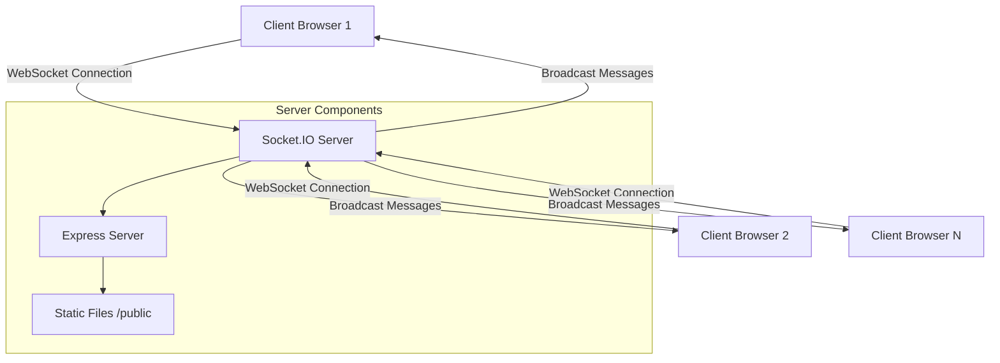
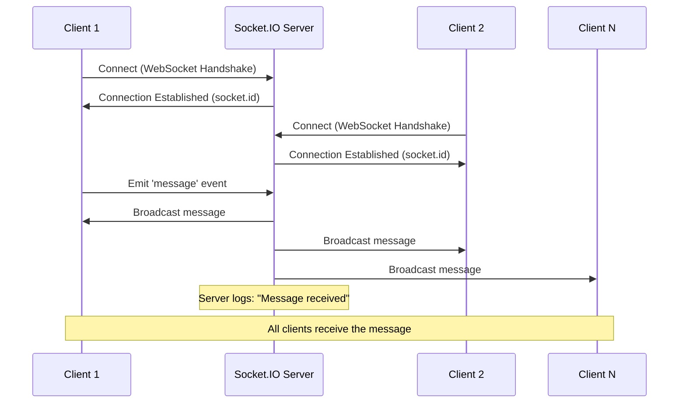
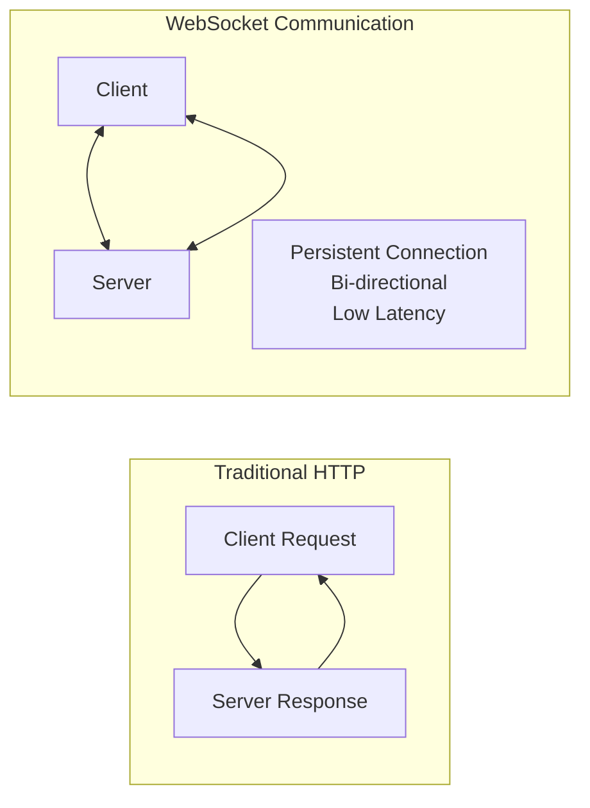
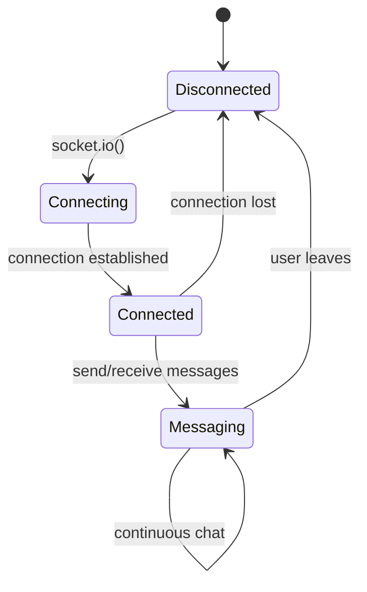

# 🔌 WebSocket Chat Application Demo

<div align="center">
  <h2>⚡ Real-time Communication | 🌐 Socket.IO | 💬 Live Chat</h2>
  
  
  
  
</div>

## About This Demo

This is a real-time chat application built with **Node.js**, **Express**, and **Socket.IO** to demonstrate WebSocket communication. The application enables multiple clients to connect and exchange messages in real-time through bi-directional communication between the server and clients.

### Key Features

- 🔄 **Real-time messaging** - Instant message delivery to all connected clients
- 🌐 **WebSocket communication** - Efficient bi-directional data transfer
- 👥 **Multi-client support** - Multiple users can chat simultaneously
- 🚀 **Simple setup** - Easy to run and test locally
- 📱 **Web-based interface** - No additional client software required

## Architecture Overview



## Communication Flow



## Project Structure

```
WEB-SOCKET/
├── index.js           # Main server file with Socket.IO setup
├── package.json       # Dependencies and scripts
├── public/
│   └── index.html     # Client-side chat interface
└── README.md          # This file
```

## Technology Stack

- **Backend**: Node.js with Express.js
- **WebSocket Library**: Socket.IO v4.8.1
- **Frontend**: Vanilla HTML/CSS/JavaScript
- **Real-time Communication**: WebSocket protocol

## Installation & Setup

### Prerequisites
- Node.js (v14 or higher)
- npm or yarn package manager

### Steps

1. **Clone or download the repository**
   ```bash
   git clone <repository-url>
   cd WEB-SOCKET
   ```

2. **Install dependencies**
   ```bash
   npm install
   ```

3. **Start the server**
   ```bash
   npm start
   ```
   
   Or for development with auto-restart:
   ```bash
   npm run dev
   ```

4. **Open your browser**
   Navigate to `http://localhost:3000`

5. **Test the chat**
   - Open multiple browser tabs/windows pointing to `http://localhost:3000`
   - Type messages in any tab and see them appear in all connected tabs instantly

## How It Works

### Server Side (`index.js`)

The server creates an HTTP server with Express and integrates Socket.IO for WebSocket communication:

```javascript
// Key server functionality:
io.on('connection', (socket) => {
    console.log("Client socket.id:", socket.id);
    
    socket.on('message', (msg) => {
        console.log('Message received:', msg);
        io.emit('message', msg); // Broadcast to all clients
    });
});
```

### Client Side (`public/index.html`)

The client connects to the Socket.IO server and handles real-time messaging:

```javascript
// Key client functionality:
const socket = io();

socket.on('message', (msg) => {
    // Display received messages
    const li = document.createElement('li');
    li.textContent = msg;
    document.getElementById('messagesList').appendChild(li);
});

// Send messages to server
socket.emit('message', message);
```

## WebSocket vs Traditional HTTP



## Event Flow Diagram



## API Events

### Client to Server Events
- `connection` - Triggered when a client connects
- `message` - Sent when user submits a chat message

### Server to Client Events
- `connect` - Confirms successful connection
- `message` - Broadcasts chat messages to all connected clients

## Development Notes

- The server listens on port **3000** by default
- All messages are broadcasted to **all connected clients**
- Each client receives a unique `socket.id` upon connection
- No message persistence - messages exist only during the session
- Static files are served from the `public` directory

## Potential Enhancements

- 📝 **Message persistence** - Store chat history in a database
- 👤 **User authentication** - Add login/username functionality
- 🏠 **Chat rooms** - Implement separate chat channels
- 🎨 **UI improvements** - Enhanced styling and user experience
- ⚡ **Message validation** - Input sanitization and rate limiting
- 📱 **Mobile responsiveness** - Better mobile device support

## License

ISC

---

*This demo showcases the power of WebSocket technology for real-time web applications. Perfect for learning Socket.IO fundamentals and real-time communication patterns.*